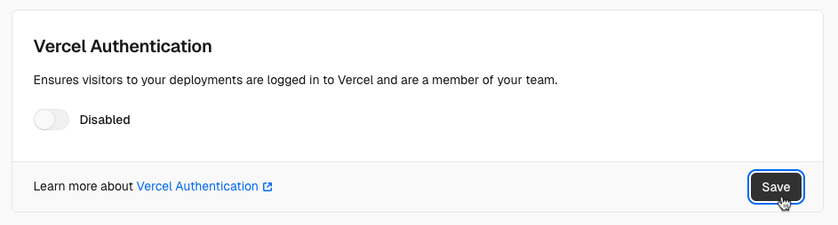

# Next.js & Checkly Starter Template

This repo showcases a simple Next.js app, hosted on Vercel, that uses Checkly to run checks before and after deployment in CI.
It includes the following features:
1. A Next.js app that fetches data from the `/api/greetings` endpoint and displays it on the landing page.
2. Checkly checks in the `__checks__` directory verify if the page loads and if the API responds correctly.
3. The necessary Checkly CLI and GitHub Actions configuration to run these checks in CI.

[](https://vercel.com/new/clone?repository-url=https%3A%2F%2Fgithub.com%2Fcheckly%2Fnextjs-checkly-starter-template)

## Quickstart

1. Fork this repo or click the "Use this template" button in the top right corner.
2. Clone the repo and run `npm install`.

    ```bash
    git clone https://github.com/checkly/nextjs-checkly-starter-template.git
    cd nextjs-checkly-starter-template
    npm i
    ```

3. Deploy the app to Vercel. You should now have a stable, production Vercel URL for your app similar to `https://nextjs-checkly-starter-template-checkly.vercel.app/`
4. Copy and paste that URL into the `.env` file as the `PRODUCTION_URL` value, e.g.

    ```
    PRODUCTION_URL="YOUR VERCEL PRODUCTION URL"
    ```
   Now we know where to aim our production checks.
5. Make sure you have a Checkly account. Just run this command and follow the instructions:
    
    ```bash
    npx checkly login
    ```
6. Run your checks in the Checkly cloud with the following commands:
      
    ```bash
    npx checkly test --env-file "./.env" --record
    ```
    This will run the checks in the `__checks__` directory and record them in your Checkly account as [test session](https://www.checklyhq.com/docs/testing/#test-sessions). You can now see them in the [Checkly test sessions dashboard](https://app.checklyhq.com/test-sessions).


7. To deploy your checks as monitors, run the following commands:

    ```bash
    npx checkly env add "PRODUCTION_URL" "<YOUR VERCEL PRODUCTION URL>"
   ```
    This command persists the `PRODUCTION_URL` to the Checkly cloud.

    ```bash
    npx checkly deploy
    ```
    This command deploys the checks in the `__checks__` directory as monitors in your Checkly account. You can now see them in the [Checkly home dashboard](https://app.checklyhq.com/).


## 2. Running Checks before & after Deployment in CI

You can run your Checkly checks right after any **Vercel Preview Deployment** and then deploy your checks as 
monitors on Checkly. This is a powerful strategy to make sure your never ship critical breaking errors
to **Production**, while at the same time surfacing any outages in your **Production Deployments**.

### 2.1 Bypassing Vercel Preview Deployment Protection

By default, Vercel Preview Deployments are protected and only accessible by logged-in users. However, we want to access
any Preview Deployment with our Playwright-powered Checkly checks. To do this, we need to bypass the protection. 

For the sake of this example repo, you can just disable this protection in the **Settings / Deployment Protection** section
in your Vercel project.



In a real-world scenario, you would create a [Vercel protection bypass token](https://www.checklyhq.com/docs/cicd/vercel-deployment-protection/) and use that in your Checkly scripts to 
authenticate against the Preview Deployment.

### 2.2 Setting up GithHub Actions

This example uses GitHub Actions. Check out the workflow in `.github/workflows/checkly.yml` but you can any other CI platform.
We have [example configs for Jenkins and GitLab CI in our docs](https://www.checklyhq.com/docs/cicd/). 


1. Create an API key [in the API keys section of your Checkly account](https://app.checklyhq.com/settings/user/api-keys)
2. Take a note of your [Checkly Account ID in the General section of your Checkly account](https://app.checklyhq.com/settings/account/general) 
3. Save your API key and Account ID as `CHECKLY_API_KEY` and `CHECKLY_ACCOUNT_ID` as **secrets** in your GitHub Actions configuration.


Now, on every deployment webhook that GitHub receives from Vercel, the GitHub Actions workflow will run the checks in the `__checks__` directory.

- A markdown formatted report will be posted as a comment in the GitHub Actions summary.
- Preview Deployments are tested against the generated preview deployment URL and recorded as test sessions in Checkly.
- Production Deployments are tested against the production URL and deployed as monitors in Checkly if all checks pass. 

Links:
- [Checkly docs on Test Sessions](https://www.checklyhq.com/docs/testing/#test-sessions)
- [Checkly docs on GitHub Actions integration](https://www.checklyhq.com/docs/cicd/github-actions/)
- [Vercel docs on running tests](https://vercel.com/guides/how-can-i-run-end-to-end-tests-after-my-vercel-preview-deployment)

## Notes

This is a [Next.js](https://nextjs.org) project bootstrapped with [`create-next-app`](https://nextjs.org/docs/app/api-reference/cli/create-next-app)
and edited where needed.
