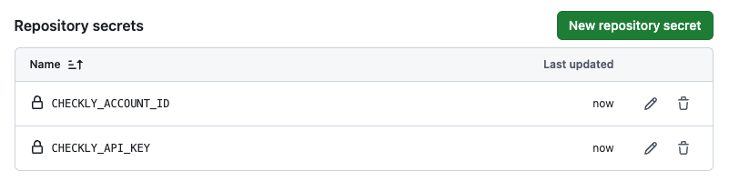

## Getting Started

## Running Checks before & after Deployment in CI

You can run your Checkly checks right after any **Vercel Preview Deployment** and then deploy your checks as 
monitors on Checkly. This is a powerful strategy to make sure your never ship critical breaking errors
to **Production**, while at the same time surfacing any outages in your **Production Deployments**.

This example uses GitHub Actions. Check out the workflow in `.github/workflows/checkly.yml` but you can any other CI platform.
We have [example configs for Jenkins and GitLab CI in our docs](https://www.checklyhq.com/docs/cicd/). 

1. Create an API key [in the API keys section of your Checkly account](https://app.checklyhq.com/settings/user/api-keys)
2. Take a note of your [Checkly Account ID in the General section of your Checkly account](https://app.checklyhq.com/settings/account/general) 
3. Save your API key and Account ID as `CHECKLY_API_KEY` and `CHECKLY_ACCOUNT_ID` as **secrets** in your GitHub Actions configuration.

Links:
- [Checkly docs on GitHub Actions integration](https://www.checklyhq.com/docs/cicd/github-actions/)
- [Vercel docs on running tests](https://vercel.com/guides/how-can-i-run-end-to-end-tests-after-my-vercel-preview-deployment)

## Notes

This is a [Next.js](https://nextjs.org) project bootstrapped with [`create-next-app`](https://nextjs.org/docs/app/api-reference/cli/create-next-app)
and edited where needed.
